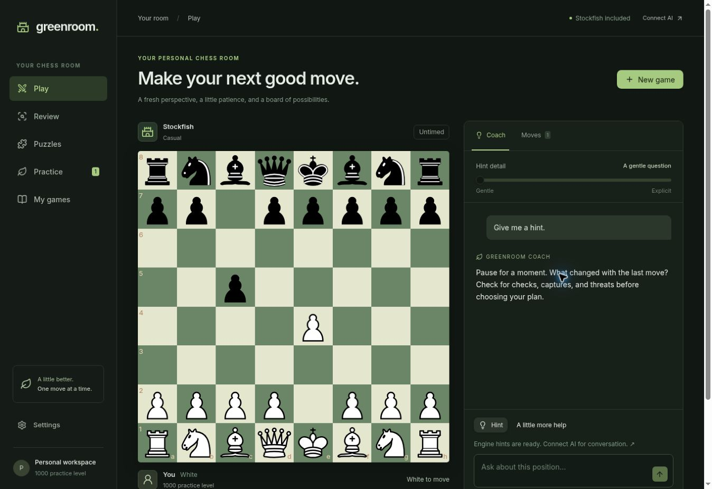

# Greenroom

Your personal chess room: play, understand, review, and practise. Built for a learner around **900–1100**, with a dark green interface and gentle coaching by default.



## What is here

| Area | Features |
| --- | --- |
| Play | Stockfish 19 at six strengths; Claude, OpenAI, or Gemini opponents; local analysis board; legal move highlighting; tap/drag/keyboard play; castling, en passant, promotion; takebacks, resignation, custom FEN |
| Coach | assistant-ui chat; streaming model replies; legal-move and variation tools; Stockfish evidence; five levels of hint detail; before/after-move or on-demand advice; frequency and explanation controls |
| Review | PGN import/export; complete engine game review; key mistakes; “why?” explanations; three-lesson retrospective; playable variations; save positions as practice cards |
| Train | 300 Lichess puzzles, rating/theme filters, progressive hints and solutions; personal mistake queue with spaced repetition; three opening walkthroughs and three endgame positions |
| Personal workspace | Local games and chat history; full JSON backup/restore with validation; provider configuration status; password-protected hosted AI endpoints; device-level request budget and token usage |

Stockfish, puzzles, local review and structured hints work without an API key. Conversational coaching and LLM opponents need a configured model.

## Run locally

Requires Node.js 24.

```sh
npm ci
cp .env.example .env.local
npm run dev
```

The postinstall script copies the pinned Stockfish worker and WASM into `public/engine`. Vite serves the frontend and local API routes together; no second server is required. If you install with scripts disabled, run `npm run prepare:engine` yourself.

```sh
npm run check       # 28 core tests, TypeScript, production frontend build
npm run format
```

`dist` contains the frontend. Deploy the repository, not only `dist`, because the LLM endpoints live in `api/`.

## Deploy to Vercel

Import **peteroomen/green-room**. Choose Vite, repository root, `npm run build`, and output `dist`. `vercel.json` configures the API functions. Use Node 24.

Set these server environment variables for the deployment environments you use, then deploy/redeploy:

| Variable | Purpose |
| --- | --- |
| `ANTHROPIC_API_KEY` | Your Anthropic API key |
| `APP_PASSWORD` | A long personal password; unlock AI in the app's Settings |
| `ANTHROPIC_MODEL` | Optional; defaults to `claude-sonnet-5-5` |
| `OPENAI_API_KEY` + `OPENAI_MODEL` | Optional OpenAI adapter |
| `GOOGLE_GENERATIVE_AI_API_KEY` + `GOOGLE_MODEL` | Optional Gemini adapter |

Never prefix secrets with `VITE_`. Never commit `.env.local`. Keys are only read on the server.

Both coach and opponent use the selected provider's configured model. You can select a different provider for a new opponent game; the coach's provider is independently chosen in Settings. Each provider currently has one configured model ID. To use another Claude model, change `ANTHROPIC_MODEL` to an ID available to your Anthropic account, then redeploy.

Hosted AI fails closed without `APP_PASSWORD`. Local development without it permits local API use. The password unlocks only AI endpoints; the app shell and device-local chess need no account.

After adding a key, verify these live flows: unlock Settings → ask the coach for a hint → ask for an explicit variation → start a Claude game → make a move → confirm a legal reply → finish the game → review it. No live paid model calls were made during the build.

## Architecture

- `src/lib/chess.ts`: chess.js is the rules authority. Every move is validated, and stale/duplicate replies are rejected against game ID, FEN and ply.
- `src/lib/engine.ts`: serialized UCI queue in a single-thread Stockfish Web Worker, with cancellation, option resets, search timeouts, and bounded analysis caching. Evaluations are normalised to White's perspective.
- `server/agents.ts`: AI SDK `ToolLoopAgent` instances with independent role-specific tool sets and bounded loops. Anthropic is called directly through its provider adapter.
- `server/contracts.ts`: strict request schemas. Opponent input strips chat/engine evidence. Coaching rejects active LLM games. The opponent's Stockfish tool always throws; the opponent has no engine implementation or analysis data.
- `server/handlers.ts`: authenticated API endpoints and newline-delimited streaming for chat. `api/` wraps these for Vercel; Vite mounts them during development.
- `src/components/Chat.tsx`: assistant-ui external-store runtime, streaming Markdown, local structured hint fallback, and validated clickable variations.
- `src/lib/storage.ts`: versioned browser storage and validated backup import. Analyses are recomputed after restore; personal cards and history survive.

The coach reads Stockfish evidence computed on the user's device and sent with the request. It can ask for evidence for those positions, validate hypothetical moves, and show legal lines. It does not run arbitrary new remote searches. Select a new position and ask again for fresh analysis.

## Deliberate limits

- Personal, untimed chess workspace. No multiplayer, competitive ratings, accounts, cloud sync, or Supabase dependency yet.
- Engine difficulty labels are settings, not calibrated Elo. Short searches and centipawn-loss labels are approximate.
- Language models can explain a position incorrectly, even with legal lines and engine evidence. Legality is enforced; explanatory correctness is not guaranteed.
- Before-move advice is a deterministic forcing-reply check. After-move advice can use conversational AI, or structured local hints without a key.
- Review summaries focus on up to three analysed moments to bound request size and cost; they are not an engine analysis of every possible variation.
- Opening walkthroughs teach one sample line each. Personal cards practise the saved recommendation, even where other moves may be playable.
- Browser storage is device/origin-specific; export backups before moving domains or clearing site data. Use one active tab when changing the workspace to avoid last-write-wins conflicts.
- Server rate limiting is in-memory and best-effort on serverless instances. The daily limit is a device-side reminder, not a hard billing cap. Set budgets with the model provider before broader public use.
- Game state is client-owned. Tool isolation prevents the app's opponent from using coaching data; this is not a tamper-proof competitive anti-cheat service.

## Validation

28 tests cover special moves, game outcomes/repetition, stale replies, custom-FEN PGN round trips, backup validation, spacing schedules, all 300 puzzle lines, opening/endgame legality, opponent tool restrictions, gentle-hint restrictions, token signing/origin checks, and a mock-model run through the real AI SDK tool loop.

Browser checks cover Stockfish play, local hints, imported-game review, saving a mistake into practice, a complete multi-move puzzle, and a 390px mobile frame without horizontal overflow. Live provider responses require your key and remain unverified.

## Credits and licence

Greenroom is GPL-3.0-or-later. See `LICENSE` and `/credits.html`.

Stockfish.js **19.0.0**, lite single-thread WASM, is GPLv3. Corresponding source and build instructions: https://github.com/nmrugg/stockfish.js/tree/v19.0.0 . Upstream Stockfish: https://stockfishchess.org . The pinned npm package is installed and its exact engine assets copied by `scripts/copy-engine.mjs`; the engine licence is shipped alongside the app.

Puzzles come from the **CC0 Lichess puzzle database**: https://database.lichess.org/#puzzles . `scripts/import-puzzles.py` reproduces curation from a downloaded CSV Zstandard file. It selects ratings 600–1800 with at least 1,000 plays and popularity at least 85. The dataset's first move sets up the puzzle; the user solves from the next ply. Source-game links are retained per puzzle.

UI: shadcn/ui + Radix, react-chessboard, assistant-ui, Lucide, and Inter. Rules: chess.js. Providers: Vercel AI SDK. These projects retain their own licences.
